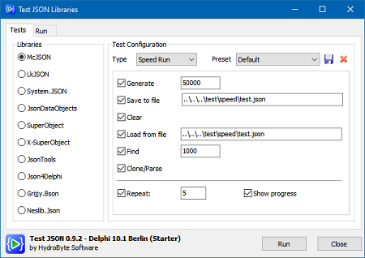
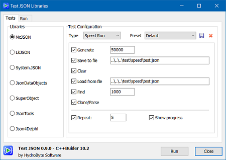

# Test JSON Libraries
A simple project to test JSON libraries with Delphi and C++Builder.

 


## Disclaimer
This is a *simple* project and not a final product. I know that there are many points that could be better structured. The initial goal was to quickly deploy a single unit "FoMain" kind of project, spending time to include and test the most popular JSON libraries for `Delphi`. The `Delphi` version has a simple structure with `TLib` and `TTest` classes. Also, it is important to mention that the size of JSON objects used in tests here doesn't represent the most common cases of data manipulation in JSON. Finally, the analysis of the results is not intended to detract from any of the tested libraries and should not be seen as any kind of criticism of the authors of the libraries. Knowledge is freedom.


## Tested libraries
Library          | Delphi | C++Builder |
:----------------|:-------|:-----------|
[McJSON](https://github.com/hydrobyte/McJSON)                                              | ✓ | ✓ |
[uLkJSON](https://sourceforge.net/projects/lkjson/)                                        | ✓ | ✓ |
[System.JSON](https://docwiki.embarcadero.com/Libraries/Sydney/en/System.JSON.TJSONObject) | ✓ | ✓ |
[JsonDataObjects](https://github.com/ahausladen/JsonDataObjects)                           | ✓ | ✓ |
[SuperObject](https://github.com/hgourvest/superobject)                                    | ✓ |   |
[X-SuperObject](https://github.com/onryldz/x-superobject)                                  | ✓ |   |
[JsonTools](https://github.com/sysrpl/JsonTools)                                           | ✓ | ✓ |
[Json4Delphi](https://github.com/MaiconSoft/json4delphi)                                   | ✓ | ✓ |
[Grijjy.Bson](https://github.com/grijjy/GrijjyFoundation)                                  | ✓ |   |
[Neslib.Json](https://github.com/neslib/Neslib.Json)                                       | ✓ |   |
[dwsJSON](https://github.com/EricGrange/DWScript)                                          | ✓ |   |
[chimera.json](https://bitbucket.org/sivv/chimera/src/develop/)                            | ✓ |   |


## Compilers and computer
- `Delphi` VCL 32 bits project built with version `11.3` (Alexandria/CE).
- `C++Builder` VCL 32 bits project built with version `10.2` (Tokyo).
- Old 64 bits machine: AMD A12-9700P RADEON R7, 10 COMPUTE CORES 4C+6G - 2.50 GHz - 12 GB RAM.


## Tests
There are three test types:
- Speed Run
  - Generate `N` items `{ ... "key_i":"value_i", ... }`
  - Save to file
  - Clear
  - Load from file
  - Find `M` items
  - Clone/parse
- Validation
- Open File


## Procedure
For each library and test type the app was ran and closed. 
The results of `Speed Run` compute the average time of 5 repetitions.
The Memory consuption is logged and will be part of some results.


## Speed Run test
This is a performance test with the following configuration (select `Default` in the `Preset` list).
- `N` = 50k items.
- `M` = 1k items (keep same random sequence for all tests).
- 5 repetitions.
- `Memory` collumn is the app memory consuption after the `Genereate` sub-test.
- It is expected that the `Clone/Parse` sub-test consumes twice as memory as the `Generate` or `Load from file` sub-test.
- See [images](https://github.com/hydrobyte/TestJSON/tree/main/images) as confirmation.

### Results with Delphi

Library          | Generate  | Save     | Load     | Find     | Parse    | Total     | Memory    |
:----------------|----------:|---------:|---------:|---------:|---------:|----------:|----------:|
`Neslib.Json`    |     .03 s |    .03 s |    .03 s |    .00 s |    .04 s |    0.18 s | 10.16 MiB |  
`Grijjy.Bson`    |     .05 s |    .04 s |    .05 s |    .00 s |    .07 s |    0.26 s |  7.48 MiB |
`chimera.json`   |     .06 s |    .03 s |    .08 s |    .01 s |    .09 s |    0.35 s |  8.77 MiB |  
`McJSON`         |     .02 s |    .06 s |    .03 s |    .20 s |    .07 s |    0.42 s |  9.84 MiB |  
`LkJson`         |     .07 s |    .05 s |    .11 s |    .01 s |    .15 s |    0.49 s |  2.88 MiB |
`SuperObject`    |     .13 s |   1.15 s |    .04 s |    .01 s |    .06 s |    1.46 s |  9.63 MiB |
`System.JSON`    |     .03 s |    .05 s |    .24 s |    .88 s |    .28 s |    1.55 s |  9.39 MiB |
`dwsJSON`        |     .02 s |    .02 s |   1.02 s |    .02 s |   1.01 s |    2.13 s |  9.88 MiB |
`JsonDataObjects`|    5.86 s |    .01 s |    .10 s |    .11 s |    .10 s |    6.22 s |  8.92 MiB |
`JsonTools`      |   11.10 s |        - |        - |    .23 s |  10.00 s |   21.37 s |  7.77 MiB |
`Json4Delphi`    |     .03 s |    .06 s |  37.43 s |    .47 s |  37.20 s |   75.24 s | 11.46 MiB |
`X-SuperObject`  |  5.18 min |    .06 s | 1.77 min |   6.18 s | 1.76 min |  8.81 min | 11.48 MiB |

### Results with C++Builder

Library          | Generate  | Save     | Load     | Find     | Parse    | Total     | Memory    |
:----------------|----------:|---------:|---------:|---------:|---------:|----------:|----------:|
`McJSON`         |     .09 s |    .08 s |    .04 s |    .39 s |    .10 s |    0.74 s |  5.09 MiB |  
`LkJson`         |     .19 s |    .08 s |    .16 s |    .01 s |    .23 s |    0.74 s |  2.88 MiB |
`System.JSON`    |     .12 s |    .08 s |    .24 s |   2.94 s |    .32 s |    3.78 s |  9.39 MiB |
`JsonDataObjects`|   15.23 s |    .02 s |    .17 s |    .30 s |    .19 s |   15.97 s |  4.30 MiB |
`JsonTools`      |   24.41 s |        - |        - |    .46 s |  23.50 s |   48.39 s |  5.78 MiB |
`Json4Delphi`    |     .10 s |    .11 s |  63.94 s |    .93 s |  64.03 s |  129.17 s |  6.81 MiB |

Notes: 
- See [Know issues](#know-issues) about the incomplete test for `JsonTools`.


## Scaling test
Here are some results just for the `Generate` sub-test increasing `N` using `C++Builder` project.

Library          | 1k        | 5k       | 10k      | 25k      | 50k     |
:----------------|----------:|---------:|---------:|---------:|--------:|
`McJSON`         |     .01 s |    .02 s |    .03 s |    .05 s |   .10 s |
`LkJson`         |     .01 s |    .02 s |    .04 s |    .10 s |   .17 s |
`System.JSON`    |     .01 s |    .09 s |    .04 s |    .07 s |   .12 s |
`JsonDataObjects`|     .01 s |    .08 s |    .26 s |   2.76 s | 15.55 s |
`JsonTools`      |     .02 s |    .12 s |    .43 s |   5.51 s | 23.87 s |
`Json4Delphi`    |     .01 s |    .02 s |    .03 s |    .06 s |   .11 s |


## Validation test
This validation test should be analyzed carefully. Some libraries have violations for some sort of self-management in reading JSON data.
- `.\test\valid` files extracted from [MJPA/SimpleJSON](https://github.com/MJPA/SimpleJSON)
- These are not valid JSON files because first line has a text as description.

### Results with Delphi

Library          | Expected to Fail but Passed                      | Expected to Pass but Failed   |
:----------------|-------------------------------------------------:|------------------------------:|
`McJSON`         |                                                - |                             - |
`LkJson`         |             fail(01, 07, 08, 16, 18, 19, 20, 21) |                             - |
`System.JSON`    |                                         fail(07) |                      pass(04) |
`JsonDataObjects`|                     fail(01, 05, 08, 15, 18, 19) |                  pass(04, 05) |
`SuperObject`    | fail(01, 06, 07, 08, 10, 11, 16, 18, 19, 20, 21) |                             - |
`X-SuperObject`  |     fail(01, 06, 08, 15, 16, 17, 18, 19, 20, 21) |              pass(01, 04, 05) |
`JsonTools`      |                             fail(01, 16, 20, 21) |                  pass(04, 05) |
`Json4Delphi`    |                                                - |      pass(01, 03, 04, 05, 06) |
`Grijjy.Bson`    |                                     fail(15, 20) |          pass(01, 02, 04, 05) |
`Neslib.Json`    |                 fail(07, 15, 16, 18, 19, 20, 21) |                  pass(04, 05) |
`dwsJSON`        |                             fail(16, 18, 19, 21) |                             - |
`chimera.json`   |         fail(01, 08, 10, 16, 18, 19, 20, 21, 23) |                             - |

### Results with C++Builder

Library          | Expected to Fail but Passed          | Expected to Pass but Failed   |
:----------------|-------------------------------------:|------------------------------:|
`McJSON`         |                                    - |                             - |
`LkJson`         | fail(01, 07, 08, 16, 18, 19, 20, 21) |                             - |
`System.JSON`    |                             fail(07) |                      pass(04) |
`JsonDataObjects`|         fail(01, 05, 08, 15, 18, 19) |                  pass(04, 05) |
`JsonTools`      |                 fail(01, 16, 20, 21) |                  pass(04, 05) |
`Json4Delphi`    |                                    - |      pass(01, 03, 04, 05, 06) |

List of test files names and description
- `fail01.json = \x is not a valid escape character`
- `fail02.json = Objects require colon between name/value`
- `fail03.json = Objects do not have comma separators`
- `fail04.json = Arrays don't have colon separators`
- `fail05.json = Truth is not a valid boolean value`
- `fail06.json = Strings need double quotes, not single quotes`
- `fail07.json = Line break in a string value is not valid`
- `fail08.json = Escaped line break char is still not valid`
- `fail09.json = Unclosed array`
- `fail10.json = Numbers require exponent if 'e' is there`
- `fail11.json = Only 1 sign char can precede the value`
- `fail12.json = Commas cannot close objects`
- `fail13.json = Brackets must be matching`
- `fail14.json = Double quotes must be escaped`
- `fail15.json = Key string must be quoted`
- `fail16.json = Arrays must not have comma after last value`
- `fail17.json = Arrays must have values between commas`
- `fail18.json = Nothing but whitespace can follow the root value`
- `fail19.json = Each opening bracket must be closed`
- `fail20.json = Extra comma after object`
- `fail21.json = Numbers cannot have leading 0s`
- `fail22.json = Numbers can't be hex encoded`
- `fail23.json = Decimal numbers need a digit before the dot`
- `pass01.json = General large array testing valid values`
- `pass02.json = Heavily nested array`
- `pass03.json = Nested object`
- `pass04.json = Simple string value`
- `pass05.json = Unicode character string`
- `pass06.json = From https://json.org/example.html`

## Open File test
This is a simple test to open files with any library included into this project.
This test will be used in a future update with very large JSON files (+ 100 MiB in size).


## Conclusions
1. All `Speed Run` tests with `Delphi` version are twice as fast as with `C++Builder`.

2. For JSON structures with less than 5000 objects, the choice of libraries can be screened not only based on performance. Standard/Compiler compatibility and ease of use should have priority in terms of choice criterion. 

3. `Neslib.Json` is the fastest library tested until now, closely followed `Grijjy.Bson`. 

4. `LkJson` has great performance and the lowest memory consumption among all tested libraries. Some changes are needed to use it with Delphi and C++Builder 10.2 in order to save and load UTF-8 encoded files. For some, an obstacle can be that their interfaces are more verbose for C++ usage. For example:
````cpp
JsonP = dynamic_cast<TlkJSONObject*>(TlkJSON::ParseText(TlkJSON::GenerateText(Json)))
````

5. The `Validation` tests can demonstrate that even the most modern libraries can have occasional small violations against the standard.

6. For older versions of `Delphi` and `C++Builder`, the `McJSON` library can be a good choice in terms of compatibility, ease of use and good performance.

7. This project demonstrates some of the facilities and obstacles encountered by C++Builder developers in using libraries developed for Delphi.


## Know issues
- `TgoBsonDocument.LoadFromJsonFile()` failed.
- `SuperObject` compiles but it is not working with C++Builder. Any help getting `SuperObject` working with C++Builder is appreciated.
- `JsonTools` had problems saving to file: it was truncated at object `"key25412"`.
- `JsonTools` gave a error `Root node must be an array or object` trying to load form a UTF-8 file with 50k items file from other sub-tests.
- `chimera.json` seems to completelly break Delphi 10.4's code completion (Code insight manager = LSP).

These libraries were tested:
- [XSuperObject](https://github.com/onryldz/x-superobject) does not compile with `C++Builder` 10.2.
- [dwsJSON](https://github.com/EricGrange/DWScript/blob/master/Source/dwsJSON.pas) does not compile with `Delphi` 10.1 Starter.


## Changes on original source code
There were necessary modifications in order to compile and run some libraries with C++Builder.
- `uLkJSON`: 
  - `{$DEFINE USE_D2009}`
  - `TlkJSONstreamed.LoadFromStream();`
  - `TlkJSONstreamed.SaveToStream();`
- `SuperObject`: 
  - `defined(VER290) or defined(VER300) or defined(VER310) or defined(VER320) or defined(VER330) or defined(VER340) or defined(VER350)`
  - `procedure FromInterface;`

